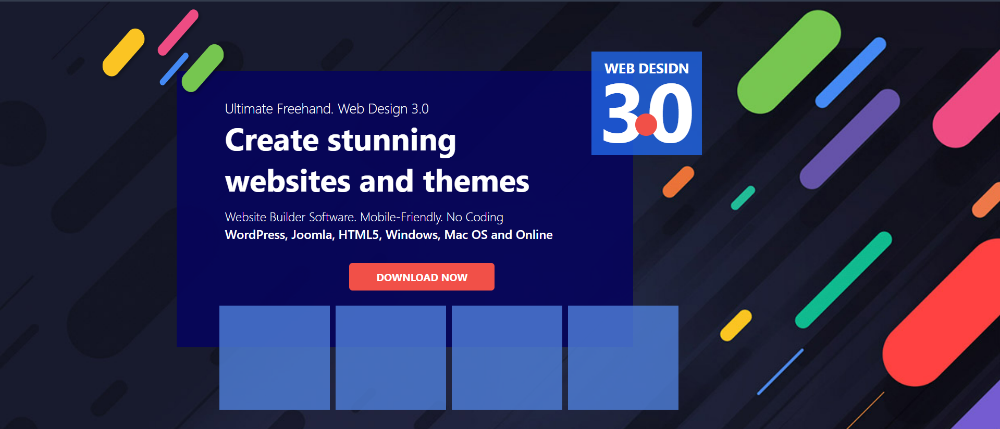

# 🌐 Web Design 3.0

## 🖼 Preview

This project showcases a modern web design based on **Web Design 3.0** principles. It features an interactive and visually appealing user interface created using HTML and CSS.

## 📌 Features
- 🎨 **Modern Design** – Sleek and attractive UI/UX
- 📱 **Responsive** – Optimized for mobile and desktop devices
- 🚀 **Fast Loading** – Minimalist code and optimized styles
- 🎭 **Animations** – CSS-powered interactive elements
- 🔥 **User-Friendly** – Easy navigation and eye-catching layout

## 🛠 Technologies Used
- **HTML5** – For structuring the content
- **CSS3** – For styling and layout
- **Flexbox & Grid** – For efficient layout management
- **Google Fonts & Icons** – For beautiful typography and icons

## 🎯 Author & Contact
- **Author:**  Faridun11
- **Email:** faridunfakhridinov777@gmail.com
- **GitHub:** [Faridun11](https://github.com/Faridun11)

Enjoy the project and don’t forget to ⭐ star the repository if you find it useful! 😊
